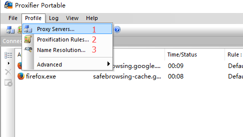
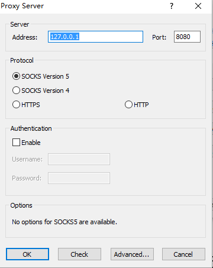
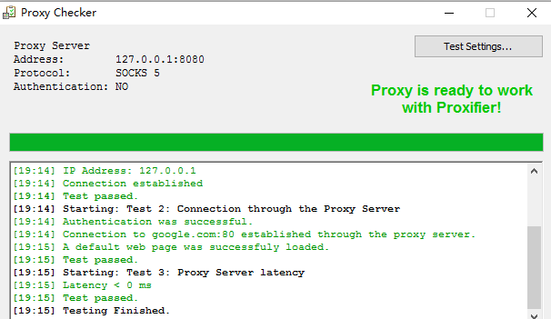
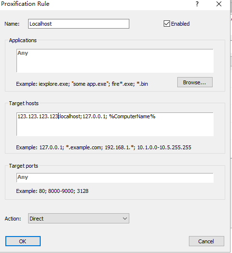
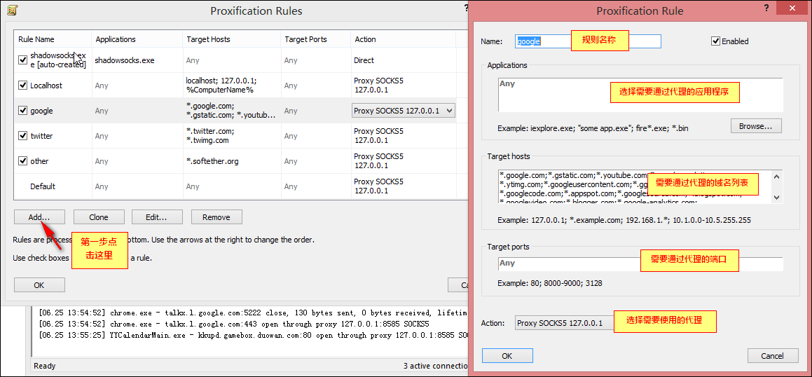
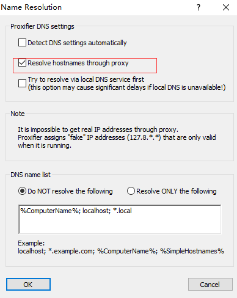

# win右键新建文件添加新的文件类型

向注册表导入注册表文件，新建`reg`文件些入以下内容。然后执行，等效于在`regedit`里面手动添加各项。

1. md文件

```reg
Windows Registry Editor Version 5.00

[HKEY_CLASSES_ROOT\.md]
@="MarkdownFile"
"PerceivedType"="text"
"Content Type"="text/plain"

[HKEY_CLASSES_ROOT\.md\ShellNew]
"NullFile"=""

[HKEY_CLASSES_ROOT\MarkdownFile]
@="Markdown File"

[HKEY_CLASSES_ROOT\MarkdownFile\DefaultIcon]
@="%SystemRoot%\system32\imageres.dll,-102"

[HKEY_CLASSES_ROOT\MarkdownFile\shell]

[HKEY_CLASSES_ROOT\MarkdownFile\shell\open]

[HKEY_CLASSES_ROOT\MarkdownFile\shell\open\command]
@="%SystemRoot%\system32\NOTEPAD.EXE %1"

```

2. 关联 `typora`的文件，想用`topora`打开的话只有这一种即可

```reg
Windows Registry Editor Version 5.00

[HKEY_CLASSES_ROOT\.md]
@="TyporaMarkdownFile"
"PerceivedType"="text"
"Content Type"="text/plain"

[HKEY_CLASSES_ROOT\.md\ShellNew]
"NullFile"=""
```

# Proxifier配置

[软件下载](<https://www.proxifier.com/>) or [网盘下载](http://pan.baidu.com/s/1jG48scu) （qsmj）

```
# 注册码 版本不通用
L6Z8A-XY2J4-BTZ3P-ZZ7DF-A2Q9C（Portable Edition）
5EZ8G-C3WL5-B56YG-SCXM9-6QZAP（Standard Edition）
P427L-9Y552-5433E-8DSR3-58Z68（MAC）
```








除了服务器的地址需要加上外，其他地址都是默认填上去的，别忘了，否则访问服务器地址时会循环代理。



按如图所示的添加，这里有个default规则，如果default旁边的action里边选择的时proxy socks5…则本机所有软件都会走代理。一般default会选direct，然后把你需要走代理的软件选成proxy socks5…



第二个选项要先取消第一个选项后，才能勾选。



用CMD命令`nslookup www.google.com`测试是否成功。

似乎`curl www.google.com`更靠谱。