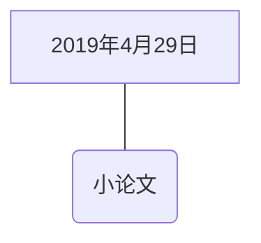

---

---

# 我的目标是开题

## 规划图

------


```flow
st=>start: 2019年4月28日
e=>end: 完成开题
op1=>operation: 写作技巧
op1_1=>operation: 开题报告
st->op1->op1_1->e
op2=>operation: 小论文
st->op2->e

```



st-->part2(nihc)
    style st center
    part2-->ed(fd)
    st-->part3(你好)
    st-->part3(你好)`<!---->`