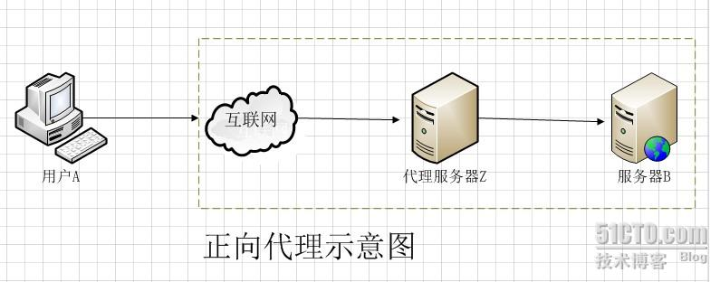
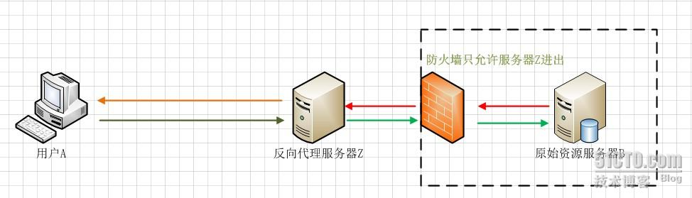

# CDN

CDN(Content Delivery Network 或 Content Distribute Network)，即内容分发网络。

**基本思路**：

尽可能避开互联网上有可能影响数据传输速度和稳定性的瓶颈和环节，使内容传输的更快、更稳定。通过在网络各处放置节点服务器所构成的在现有的互联网基础之上的一层智能虚拟网络，CDN系统能够实时地根据网络流量和各节点的连接、负载状况以及到用户的距离和响应时间等综合信息将用户的请求重新导向离用户最近的服务节点上。

**目的**：

解决因分布、带宽、服务器性能带来的访问延迟问题，适用于站点加速、点播、直播等场景。使用户可就近取得所需内容，解决 Internet网络拥挤的状况，提高用户访问网站的响应速度和成功率。

**优势**：

就近缓存，优化调度路径，协议优化。

# 代理技术

## 正向代理

**Cache（缓存）**：缓存技术和代理服务技术是紧密联系的（不光是正向代理，反向代理也使用了Cache（缓存）技术。还如上图所示，如果在用户A访问服务器B某数据J之前，已经有人通过代理服务器Z访问过服务器B上得数据J，那么代理服务器Z会把数据J保存一段时间，如果有人正好取该数据J，那么代理服务器Z不再访问服务器B，而把缓存的数据J直接发给用户A。这一技术在Cache中术语就叫Cache命中。如果有更多的像用户A的用户来访问代理服务器Z，那么这些用户都可以直接从代理服务器Z中取得数据J，而不用千里迢迢的去服务器B下载数据了。

## 反向代理

用户A始终认为它访问的是原始服务器B而不是代理服务器Z，但实用际上反向代理服务器接受用户A的应答，从原始资源服务器B中取得用户A的需求资源，然后发送给用户A。由于防火墙的作用，只允许代理服务器Z访问原始资源服务器B。尽管在这个虚拟的环境下，防火墙和反向代理的共同作用保护了原始资源服务器B，但用户A并不知情。

*反向代理在现时的互联网中并不少见，而另一些例子，像是[CDN](https://baike.baidu.com/item/CDN)、SNI代理等，是反向代理结合[DNS](https://baike.baidu.com/item/DNS)的一类延伸应用。*

# 名词解释

**DNS**：即Domain Name System，是域名解析服务的意思。它在互联网的作用是：把域名转换成为网络可以识别的ip地址。人们习惯记忆域名，但机器间互相只认IP地址，域名与IP地址之间是一一对应的，它们之间的转换工作称为域名解析，域名解析需要由专门的域名解析服务器来完成，整个过程是自动进行的。

**DDos**：是一种攻击服务器的方式，主要分为三种类型。

- lp lood：用多个主机对目标发送大量ip包，而使其不能处理其他正常包；
- Syn Flood：依据tcp建立连接的三次握手，向目标发送syn包，而在收到目的主机的syn+ack包后并不回应，使目标为了维护大量无用的连接队列而无法正常服务。
- Udp反射Flood：有时被保护服务器也有同外部服务器进行udp交互的需求，攻击者就会利用此交互对被保护服务器进行udp反射放大攻击。此攻击在短时间那冒充被攻击地址向外部公用的服务器发送大量的udp请求包，外部服务器收到虚假的udp请求就会回复大量的回应包给被攻击服务器地址，造成目标主机被保护服务器不能处理其他正常的交互流。

**域名**：.com顶级域名

baidu.com 一级域名

tieba.baidu.com 二级域名

detail.tieba.baidu.com 三级域名

(其他级别域名以此类推)

# cloudflare
**cloudflare**： 是一家国外的 CDN 加速服务商，还是很有名气的。提供免费和付费的加速和网站保护服务。

在其上添加网站分为四步：添加网站域名、添加DNS记录、选择方案、更新域名服务器。

在添加DNS记录时全部调为黄色云朵走 CDN 访问，隐藏网站真实 IP 地址。全站通过 CDN 访问可以有效防止网站真实IP泄漏，保护原站安全。另外，记录简单的话可以直接按默认条目；如果没有扫描出来原记录或要手动添加，建议至少添加 @ 和 www 两条指向原网站 IP 的 A 记录，TTL 默认。

gcajh2hMuTRn